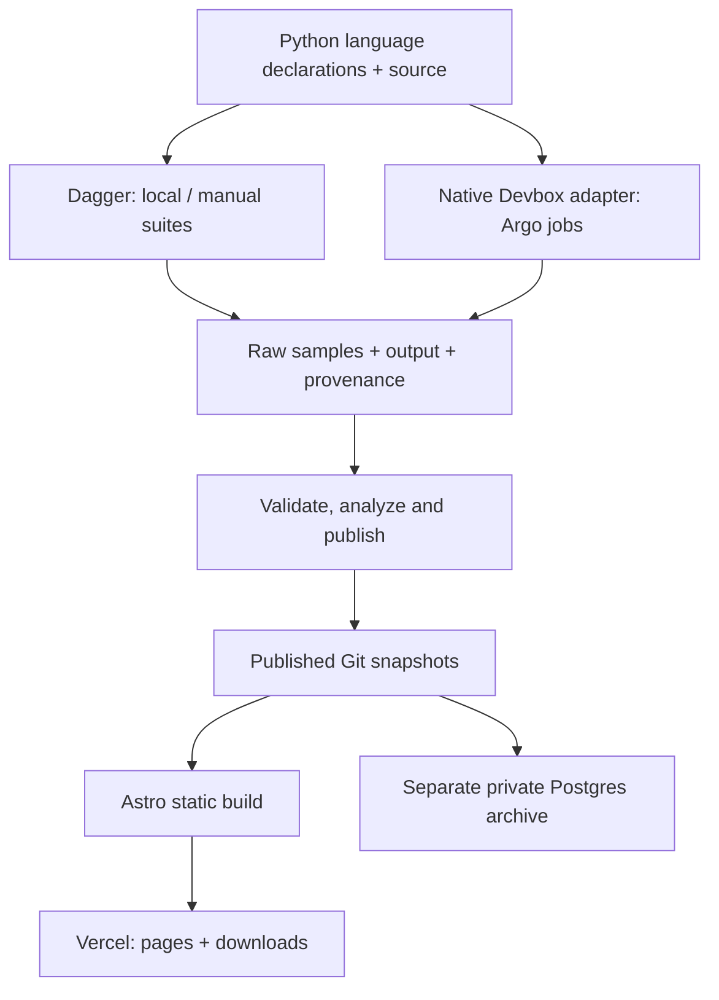

# Speed comparison of programming languages

[](https://github.com/niklas-heer/speed-comparison/actions/workflows/ci.yml)

**One calculation, many implementations, and the evidence behind every timing.**

Speed comparison is an open microbenchmark of loops and floating-point arithmetic.
It asks how different implementations compute the same Leibniz approximation of π,
then records the source, toolchain, commands and individual measurements needed to
investigate the result. A target can be a language, a compiler choice, or an optimized
variant—not just a language name.

[Explore the results](https://speed-comparison.vercel.app/) ·
[Read the methodology](https://speed-comparison.vercel.app/methodology/) ·
[Follow the interactive pipeline](https://speed-comparison.vercel.app/journal/how-code-becomes-a-benchmark/)

**In this README:** [Scope](#what-this-measures) · [Latest results](#latest-results) ·
[Quick start](#quick-start) · [How it works](#how-it-works) ·
[History](#how-the-project-evolved) · [Contributing](#contributing) ·
[Repository map](#find-your-way-around)

## What this measures

Every implementation evaluates terms of the same alternating series:

```text
π ≈ 4 × (1 − 1/3 + 1/5 − 1/7 + …)
```

The formula is deliberately small enough to inspect across languages. It converges
slowly, so it is useful here as a repeatable arithmetic workload rather than an
efficient way to calculate π. Outputs must be finite and pass a workload-dependent
convergence check; correctness still matters even though maximum π precision is not
the goal.

| This project is | It does not establish |
| --- | --- |
| A comparison of specific implementations, compilers and settings | A universal ranking of programming languages |
| A single-threaded numerical microbenchmark | Web-server, database, I/O or whole-application performance |
| An experiment that exposes source, samples and recorded environment details | Identical hardware conditions or guaranteed reproducibility on every machine |
| A place to study scalar code, compiler optimization and explicit SIMD | That different math modes or algorithms are interchangeable |

Ranked implementations stay single-threaded and use the Leibniz series. Explicit
SIMD variants, which process several values per instruction, get separate targets.
Compiler flags, relaxed floating-point math and paired-term transformations must
remain visible. The [standalone Fortran OpenMP example](src/alt/README.md#fortran-with-openmp)
is preserved outside the ranked comparison.

Read differences within a compatible hardware, workload and protocol group. Check
source and build settings before attributing a gap to the language. Three samples
and their observed range cannot establish a statistically reliable winner for every
small difference. See [how to inspect a result](https://speed-comparison.vercel.app/journal/a-more-inspectable-benchmark/)
for a walkthrough using actual Go measurements.

## Latest results

<!-- latest-run:start -->
**Latest full run: 5h 18m 46s · 75 implementations · 1 billion terms per execution.**

[Inspect the run](https://speed-comparison.vercel.app/runs/2026-09-05T193245/) ·
[Download the full-resolution image](https://speed-comparison.vercel.app/report-images/latest.png) ·
[Why a billion terms and repeated measurements?](https://speed-comparison.vercel.app/journal/why-a-billion-terms/)

This historical Argo clock includes checkout, setup, measurement, analysis and the failed
publication attempt; it excludes the later publication-only retry. Its six-execution
protocol is distinct from the new one-warmup/three-measurement protocol. The chart
shows **median** times and observed sample ranges, with SIMD and relaxed math labeled.
<!-- latest-run:end -->

<details>
<summary>View the full comparison chart</summary>

[](https://speed-comparison.vercel.app/report-images/latest.png)

</details>

The published September 5, 2026 baseline used native Devbox jobs in Argo on a shared
x86-64 VM. It predates the current runner protocol. New package pins and successful
smoke checks do **not** replace that published dataset. Historical snapshots retain
their original samples and missing metadata; later recovery evidence is kept separately.

## Quick start

Run these commands from the repository root unless a step says otherwise.

### Check the code without running benchmarks

Install [uv](https://docs.astral.sh/uv/getting-started/installation/) and use Python
3.11 or newer (CI uses 3.12). This runs the configuration, selection, measurement and
metadata regression tests; it does not need Docker or install language toolchains.

```sh
git clone https://github.com/niklas-heer/speed-comparison.git
cd speed-comparison
uv run --locked --project dagger-poc --extra dev pytest dagger-poc -q
```

### Run one implementation

Start Docker, then run a short Go check. The Dagger Python SDK provisions its CLI
and engine; Nix and Devbox run inside the container, so you do not need to install
every compiler on your host. The first run needs network access and may spend much
longer downloading the toolchain than doing the calculation.

```sh
QUICK_TEST_ROUNDS=10000 USE_LOCAL_IMAGES=1 \
  uv run --locked --project dagger-poc python dagger-poc/benchmark.py \
  --output ./results/quick-go go
```

`USE_LOCAL_IMAGES=1` builds the environment locally instead of relying on a published
registry image. Choose a **new output directory** for each attempt, or omit `--output`
to create `results/<run-id>/` automatically. Add target names to check several
implementations in one suite. To list available target IDs:

```sh
uv run --locked --directory dagger-poc python -c \
  'from languages import LANGUAGES; print("\n".join(LANGUAGES))'
```

Omitting `QUICK_TEST_ROUNDS` uses [`src/rounds.txt`](src/rounds.txt), currently one
billion terms. Keep the short workload while developing: it checks functionality,
not performance. Some targets require x86-64 and AVX2 or AVX-512 instructions;
emulation and a busy development machine are unsuitable for publishing comparable
timings.

### Inspect and analyze that run

The quick check above writes a bundle like this:

```text
results/quick-go/
├── run.json          # Status, protocol, tooling and whole-invocation clock
└── targets/
    ├── go.json       # Samples, output, source, commands and environment
    └── rounds.txt    # The workload actually used
```

Successful targets are saved immediately, including when a later target fails.
Run the analyzer against the **targets directory** and its matching workload file:

```sh
uv run --locked analyze.py \
  --folder ./results/quick-go/targets \
  --rounds ./results/quick-go/targets/rounds.txt \
  --out ./results/quick-go/report
```

This generates local CSV, JSON, metadata and a PNG chart. It does not publish them.
The analyzer discovers the sibling `run.json`; individual execution times and the
whole-run clock remain distinct. The reporting dependencies are in the root
[`pyproject.toml`](pyproject.toml), separate from the Dagger runner's dependencies.

### Work on the website

With Node.js 24 and npm installed:

```sh
cd site
npm ci
npm test
npm run build
npm run dev
```

Astro builds from the committed snapshots. You need neither a benchmark run nor a
database connection to work on the site. See the [site guide](site/README.md) for
browser checks, journal authoring and archive operations.

## How it works



The two execution paths currently share declarations and measurement helpers. The
intended consolidation is Argo scheduling the same Dagger runner used locally;
**that deployment to an isolated, persistent worker is still pending**.

| Component | Responsibility |
| --- | --- |
| [`languages.py`](dagger-poc/languages.py) | Declares packages, source paths, setup, compile/run commands and implementation labels. |
| Nix through Devbox | Resolves and installs the toolchain; resolved package information is retained with results. |
| [`benchmark.py`](dagger-poc/benchmark.py) and [`suite.py`](dagger-poc/suite.py) | Prepare a Dagger suite, measure selected targets and preserve its evidence. The `dagger-poc/` name remains for compatibility. |
| [Hyperfine](https://github.com/sharkdp/hyperfine) and [`measurement.py`](dagger-poc/measurement.py) | Execute the common timing protocol. |
| [`scmeta.py`](dagger-poc/scmeta.py) and [`result_metadata.py`](dagger-poc/result_metadata.py) | Collect samples/output and validate and describe the result. |
| [`native.py`](dagger-poc/native.py) and [Argo submission](scripts/argo_bench.py) | Run the native migration adapter in the homelab; cluster access is for operators. |
| [`analyze.py`](analyze.py), [`publish.py`](publish.py) and [`site/`](site/) | Turn recorded evidence into archived snapshots and inspectable static reports. |

### Reuse preparation; take fresh measurements

The Dagger runner prepares environments and builds with bounded concurrency (two
by default). It waits for **every preparation to finish or fail before timing any
target**, then measures targets serially. Compilers should not compete with the
program being measured.

Reusable build layers can be cached. A fresh measurement ID is introduced after
the build boundary so a cached timing cannot masquerade as a new observation.
The current `leibniz-1w-3m-v1` protocol runs one warmup, which also captures π,
followed by three measured executions. Compilation is outside the stopwatch;
process startup, input/output and any JIT work within an execution remain inside.
Warmups are separate processes, not a persistent warmed-up runtime.

The report shows the median and observed minimum/maximum where available. Its
range is not a confidence interval. The [measurement story](https://speed-comparison.vercel.app/journal/why-a-billion-terms/)
explains the workload, repetition count and calibration work.

### Keep the source and recipe together

Working-tree mode is useful while editing. For a committed experiment,
`--revision FULL_SHA` resolves declarations and source from the same repository
commit and retains `catalog.json` and source-revision evidence. This fetches the
revision from GitHub, so it must already be available there. The runner itself
remains trusted code.

Add `--base BASE_SHA` to select affected targets instead of naming them explicitly.
Both commits must be available locally for planning. Shared source changes select
all consuming variants; shared runner/tooling changes can select the whole suite.
See the [runner guide](dagger-poc/README.md) and [catalog boundary](docs/catalog-resolution.md).

### Separate validation, measurement and publication

GitHub Actions runs regression tests and produces an affected-target plan for PRs.
Website and reporting changes have their own checks. Producing a plan does not
automatically dispatch a benchmark to the homelab. The optional Dagger workflow is
manually triggered; native Argo jobs remain available to operators.

The weekly Nix version checker opens update proposals. Package updates require
native smoke validation, not just syntactically valid declarations. The weekly
full-benchmark schedule remains suspended pending worker isolation and rollout
validation. The planned policy is to report only when benchmark inputs changed
since the last successful publication.

Published Git snapshots are the portable record. The private Postgres archive
indexes evidence independently, and the public site reads snapshots at build time.
A website edit or publication retry can use existing results without rerunning the
calculation. Public language images and an optional builder also exist, but current
images contain Devbox environments; minimal dependency-only image export is not
implemented. See the [consolidation record](docs/pipeline-consolidation.md) for the
current execution status and remaining deployment gates.

## How the project evolved

The project began as a small, shareable comparison inspired by Thomas Christlieb's
work. Contributions expanded both the language coverage and the questions worth
asking about optimization and fairness.

| Period | What changed |
| --- | --- |
| **2022 onward** | Published charts and downloadable snapshots established a history that can still be explored in the [archive](https://speed-comparison.vercel.app/runs/), including [October 2022](https://speed-comparison.vercel.app/runs/2022-10-15T164557/). |
| **2025** | The Earthly/GitHub Actions pipeline grew automated builds and version checks. Results gained more hardware and environment context; the [Earthfile](Earthfile) remains a legacy reference. |
| **February 2026** | Dagger and Buildkite work explored a portable runner and checked parity with legacy toolchains, flags and runtime behaviour. |
| **September 2026** | Nix/Devbox declarations and native Argo jobs produced the 75-implementation migration baseline. The unified Dagger runner added reusable preparation, fresh measurements and revision-bound sources. Astro brought source inspection, package provenance and raw samples to the public report. |
| **Next** | Validate an isolated persistent Dagger worker behind Argo, calibrate a practical reporting workload, and connect authorized contribution checks to that execution path. |

These changes improve how experiments are run and explained; they do not make old
and new hardware/protocols directly comparable. Read the [project journal](https://speed-comparison.vercel.app/journal/)
for the stories, or the [migration tracker](docs/nix-migration.md) for implementation
and validation details.

## Contributing

Improvements to implementations, methodology, reporting and documentation are all
welcome. A surprising result is a good starting point for an investigation.

1. **Find the target.** Read its source under `src/` and its declaration in
   [`languages.py`](dagger-poc/languages.py). For a new language, add both.
2. **Keep the experiment explicit.** Preserve the single-threaded Leibniz workload.
   Give optimized variants distinct target IDs and accurate math/SIMD labels.
   Record compiler flags, pin package versions and use immutable revisions for
   flake inputs.
3. **Check correctness and integration.** Run the regression tests and a small
   native smoke check for affected targets. Exercise odd/even term counts and
   vector-tail handling when changing those paths. A short timing is not evidence
   of a speedup.
4. **Explain the change.** Include what changed, the commands and environment used
   to validate it, and any limitations. Performance claims need comparable before/
   after samples; retain the underlying evidence.

Report a problem through [GitHub issues](https://github.com/niklas-heer/speed-comparison/issues).
For a result discrepancy, include the run/target link, workload, hardware, compiler
and command when available. Existing code is open to improvement; the current
implementation of a language is not a ceiling on its performance.

## Find your way around

| Path | Start here for |
| --- | --- |
| [`src/`](src/) | Programs and the reference workload in `rounds.txt`. |
| [`dagger-poc/`](dagger-poc/) | Language definitions, execution adapters, measurement helpers and regression tests. |
| [`scripts/`](scripts/) | Target selection, Argo submission, calibration and report utilities. |
| [`results/`](results/) | Local run bundles; generated results do not become published automatically. |
| [`docs/history/`](docs/history/) | Published snapshots and original downloadable artifacts. |
| [`docs/report-evidence/`](docs/report-evidence/) | Separately recovered provenance and historical run context. |
| [`docs/validation/`](docs/validation/) | Recorded migration, calibration and smoke-check evidence. |
| [`site/`](site/) | Astro pages, journal articles, data preparation and browser tests. |

## Credits and license

Created by [Niklas Heer](https://nheer.com) and the
[contributors](https://github.com/niklas-heer/speed-comparison/graphs/contributors).
Thanks to [sharkdp](https://github.com/sharkdp/hyperfine) for Hyperfine, and to
[Thomas Christlieb](https://www.thomaschristlieb.de/performance-vergleich-zwischen-verschiedenen-programmiersprachen-und-systemen/)
for the original inspiration.

Code is available under the [MIT license](LICENSE).
