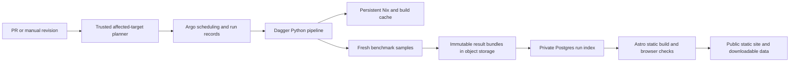

# Benchmark pipeline architecture

Design revision: 2026-09-05. This follows the maintainer's clarification that Dagger
is intended to be the common execution layer, contributions should select their
own affected languages, and publication should balance useful measurements with
short turnaround. The native Argo adapter is a migration bootstrap, not the target
architecture.

The [consolidation decision](pipeline-consolidation.md) records the measured runtime
breakdown, the unified runner implementation and the next acceptance gates.

## Responsibilities

Argo owns scheduling, queueing, deadlines, retries at safe boundaries and artifact
handoff. Dagger owns environment preparation, compilation and benchmark execution,
using the same code locally and in the homelab. Python `Language` declarations
remain the authoring source. KDL and Go are independent possible later changes;
neither is needed for selective checks or persistent build caching. The
[SDK experiment](dagger-sdk-comparison.md) found seconds of orchestration savings,
not evidence of a faster multi-hour workload.

The production native path was selected to fit a restricted namespace without a
privileged engine. It shares declarations and metadata, but duplicates execution
logic and throws away environment caches with each target pod. That compromises
the original intended architecture. Return to Argo invoking Dagger with a persistent
engine, rather than treating Argo as a replacement for Dagger.

Dagger needs a separate engine security boundary. Keep the Argo client restricted;
run a private engine on a dedicated benchmark worker, retain `/var/lib/dagger`, pin
client/engine versions and disable unnecessary insecure execution entitlements.
Do not expose an unauthenticated engine socket across the cluster/public network.
The current homelab workers also host databases and other applications, so placing
a privileged engine and unreviewed PR workloads there is not an isolation design.
Use an isolated worker/VM boundary and a narrowly scoped connection. Record the
actual machine identity; virtualized EPYC CPU labels alone do not ensure identical
hardware performance or eliminate noisy neighbors.

## Separate contribution checks from reports

Every PR gets the fast Python validation suite and an affected-target plan. The
planner compares the merge base with the exact proposed revision. It selects:

- Every variant that consumes a changed source, source directory or extra file.
- A changed language declaration and users of changed shared compiler settings.
- All languages for shared execution/tooling changes or unknown source inputs.
- No benchmark jobs for documentation-only or report-only changes.

Root reporting dependencies and report scripts select a separate lightweight check.
It renders recorded data and verifies local publication, raw samples, source metadata
and icon conversion in a temporary directory. It does not run compilers/benchmarks
or push results. The Dagger environment lock still selects all benchmark targets.

The planner must not execute PR Python just to discover targets. `scripts/affected_targets.py`
implements this using AST inspection. Its output contains source revisions,
selection reasons and removed targets. GitHub currently uploads the plan; that is
not yet an automatic homelab dispatch. A trusted dispatcher must recompute selection
and apply the authorization policy to the exact head SHA, rather than trusting a
PR-produced plan artifact.

Homelab validation runs correctness cases (including small odd/even/SIMD tails),
then optional before/after measurements for affected targets. Compile both revisions
with recorded environments and compare on the same benchmark worker. A package or
flag change is part of that experiment, not silently held constant. Do not rerun
all 75 targets because one Go source changed. Shared-runtime changes legitimately
trigger broader checks.

Use a narrowly scoped GitHub App/check integration or equivalent scoped credential
for dispatch and status. Keep publishing/database credentials out of test execution.
Fork PR execution must be explicitly authorized for its current head revision, and
the driver itself must come from trusted code. Do not run a PR's replacement runner
on a credentialed Argo client. Source and declarative configuration can be evaluated
inside the isolated execution boundary. The [catalog resolver](catalog-resolution.md)
now provides a tested Python-to-JSON boundary through Dagger, preserving the current
authoring format. The existing benchmark entry point now consumes it with `--revision`, including
its tooling and source binding; trusted event dispatch remains a separate step. Superseded queued PR revisions can be
cancelled; preserve completed evidence.

## Choose workload sizes from evidence

One billion rounds is not intrinsically correct. Longer runs can separate startup
from steady computation, but repetitions of an already long interpreted benchmark
make contributor feedback needlessly slow. A single tiny workload can also reverse
rankings by mostly measuring process startup. We need to expose that distinction.

Calibrate a versioned comparison profile using a common geometric sequence such as
100,000 / 1,000,000 / 10,000,000 / 100,000,000 / 1,000,000,000 rounds. Start with
representative compiled, interpreted, JIT and vectorized targets. Record individual
samples, process startup effects, variance and scaling. Enforce per-point and
per-target time budgets; mark skipped/timed-out points explicitly. Keep compilation
outside measurement. Reuse compiled artifacts across input sizes where the declared
build does not depend on the workload.

The first [six-target scaling experiment](validation/2026-09-05-workload-calibration/README.md)
is complete: it confirms small-command overhead in C/Go, substantial fixed cost in
Java, and budget limits for the slow tail. It identifies 100m rounds as a candidate,
with larger reporting-budget validation still needed on the isolated Dagger runner.

The default profile should be chosen after this calibration, not from an unmeasured
promise of a ten-minute suite. Candidate goals are a warm selected-language check
in a few minutes and a normal published comparison in tens of minutes or less.
Cold compiler installation is a separately reported preparation cost.

For the public view, compare raw times only at the same round count and within a
compatible hardware/methodology cohort. Offer larger common-size comparisons for
fast implementations and show coverage gaps when slow implementations exceed the
budget. Never combine differently sized runs into one raw-time ranking. If showing
nanoseconds per term or a fitted throughput, require measured scaling evidence and
label it as derived; do not assume linear scaling. Show uncertainty/ties when the
data does not reliably separate implementations. Store sufficient raw data to revise
the presentation without rerunning the benchmark.

The historical billion-round view remains available and separately labelled.
Occasional full runs can verify scaling and historical continuity. Their completion
must not gate ordinary PR checks or site-only changes. The completed native
full suite provides migration baseline evidence without becoming the permanent
weekly pipeline policy.

## Reduce avoidable work first

Measured on the current full run, C spent about one second in six executions inside
a 70-second Argo step. Rust SIMD spent about one second inside a 92-second step.
The logs show bootstrap Python and Nix toolchains being installed in each disposable
pod. This is a material preparation problem, independent of Python SDK overhead.

- Retain the engine cache across runs and reuse toolchain layers across variants.
- Prepare independent toolchains with bounded concurrency, separately from timing.
- Keep timing serial on a given benchmark worker. Parallelize across independently
  isolated, comparable workers only when recording that distinction; do not start
  competing compilers beside measurements and call the results reproducible.
- Reuse the first of two warmups to capture pi. This reduces six executions to five
  while retaining two warmups and three measurements: up to one sixth less benchmark
  computation, not one sixth less total pipeline time.
- Add a fresh Dagger measurement input after reusable build stages. Build caches
  are useful; cached timing results are not new measurements.
- Retry artifact upload/index/site build independently where idempotent. Preserve
  completed target results if a later target fails instead of discarding all work.

The shared five-execution protocol and Dagger cache boundary are implemented.
Two real local Dagger runs reused build layers and produced distinct fresh
sample arrays/measurement IDs. The Python suite, including target-selection and
measurement protocol tests, has 137 passing cases at this design revision.

## Results, database and website

Follow nheer.io's separation between private data access and tested static deployment.
An Astro build reads a validated snapshot in the cluster, emits static assets and
public JSON/CSV, passes browser checks, and only then publishes. Browsers never need
Postgres credentials. A website change rebuilds the website, not the benchmarks.
The existing GitHub Pages/history remains available during migration; an Astro
rewrite must preserve historical links and downloadable datasets.

Object storage holds immutable raw bundles under a dedicated results prefix with
retention independent of Argo's 30-day log cleanup. Include source SHA, source and
artifact hashes, input rounds, protocol version/hash, toolchain versions, Devbox
config and lock, compiler flags, math/SIMD/algorithm labels, hardware/OS/CPU flags,
runner identity, per-sample times/exit codes/output checks, timestamps and workload
status. Check that generated result bundles remain retrievable before promoting a
public snapshot. A version label without its resolved environment is insufficient.

Use a private `speed_comparison` database on the existing Postgres cluster with
separate writer and read-only site roles. Start with a small schema:

- `runs`: immutable revision, profile/protocol, environment, timestamps and status.
- `target_runs`: target, resolved toolchain, workload size, outcome and artifact hash/key.
- `samples`: individual durations, ordering, exit/output checks and measurement IDs.
- `snapshots`: explicit validated public cohorts and their publication versions.

Ingestion is idempotent by run/target/workload/attempt identity and rejects conflicting
payloads. Postgres indexes the immutable evidence; it is not the sole copy of results.
Pin the exact snapshot during a site build so it cannot mix data arriving mid-build.
Take database backups and verify restoring an index from raw bundles. Historical
imports retain their original provenance and missing metadata rather than inventing
Nix/hardware details.

A modern site should expose a workload selector, scalar/optimized filters, uncertainty,
compiler flags, source revision, environment details, per-language scaling/history,
and direct downloads. Explain that this is a Leibniz implementation comparison,
not a universal ranking of programming languages.

## Rollout gates

1. Merge target planning, fresh measurements and removal of redundant execution
   after preserving the current run's source/publication boundary.
2. Establish the isolated persistent Dagger engine; prove warm-cache reuse and fresh
   measurements through Argo with the same Python driver used locally.
3. Connect authorized PR revisions to affected-target execution and GitHub check
   results; prove a source-only PR runs its dependent variants and a docs PR runs none.
4. Calibrate and version the practical comparison profile using raw scaling evidence.
5. Add durable result ingestion and idempotent snapshot export on the homelab.
6. Build/test the Astro view against historical and new snapshots, then cut over
   publication and scheduling. Keep the old public site as rollback until verified.

Do not automatically enable the native weekly full-suite schedule simply because the
migration baseline finishes. The maintainer's clarified architecture and calibration
requirements supersede that earlier rollout gate.

References: [Dagger Kubernetes guidance (newer release)](https://docs.dagger.io/reference/deployment/kubernetes/),
[Dagger engine requirements](https://docs.dagger.io/0.19/reference/configuration/engine/),
[Hyperfine timing and warmup behavior](https://github.com/sharkdp/hyperfine), and
[pyperf guidance on assessing unstable results](https://pyperf.readthedocs.io/en/latest/analyze.html).

The Kubernetes deployment page tracks newer Dagger releases; it is forward-looking
guidance, not a validated deployment recipe for the tested 0.19.8 engine. The engine
configuration reference is pinned to the 0.19 documentation series.
