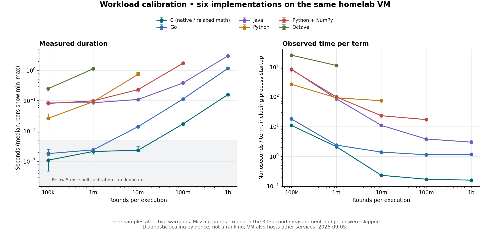

# Workload scaling experiment

Six implementations ran serially on the existing `slick-badger` homelab VM, using
source `17c713d` and the new five-execution protocol. Each environment and program
was prepared once, then reused at common round counts from 100,000 to one billion.
Every measured point used two warmups and three fresh samples. The 30-second budget
covers the complete measurement command at each larger point, not one sample.
After a timeout, larger points for that target were explicitly skipped. Preparation
had a separate ten-minute pod deadline. Initial preparation and the 100k point are
recorded together; this experiment does not separately measure engine/setup costs.

All six calibration steps succeeded; 24 workload points returned samples, three
exceeded the budget and three were skipped. This is diagnostic evidence on a VM
that also hosts other services, not a new public ranking or dedicated-hardware claim.

Median **seconds per execution** (timeouts concern the full five-execution point):

| Target | 100k rounds | 1m | 10m | 100m | 1b |
| --- | ---: | ---: | ---: | ---: | ---: |
| c | 0.0011 | 0.0021 | 0.0023 | 0.0172 | 0.1601 |
| go | 0.0018 | 0.0024 | 0.0140 | 0.1140 | 1.1678 |
| java | 0.0845 | 0.0858 | 0.1102 | 0.3848 | 3.0251 |
| python | 0.0263 | 0.0928 | 0.7406 | timeout | skipped |
| cpython-numpy | 0.0818 | 0.0991 | 0.2324 | 1.7238 | timeout |
| octave | 0.2497 | 1.1270 | timeout | skipped | skipped |

## What the data supports

- Tiny inputs do not provide a useful steady-computation comparison for every
  implementation. C remained below Hyperfine's 5 ms shell-calibration warning
  threshold through ten million rounds. Go crossed it earlier. Java took roughly
  85 ms at both 100k and 1m rounds, showing a large fixed cost at these sizes.
- At 100m rounds, C and Go took about 17 ms and 114 ms. Their observed time per term
  is closer to the billion-round value, while Java still has material fixed cost.
  The chart includes process startup; it does not pretend to estimate pure loop cost.
- A universal billion-round gate is expensive: Python, NumPy and Octave exceeded
  the 30-second point budget before completing that size. The earlier full baseline
  provides their billion-round evidence, under its separately recorded protocol.
- Three samples on a shared VM are insufficient to settle close rankings or select
  a universal variance threshold. The min–max bars are observed ranges, not confidence
  intervals. No times are extrapolated for missing points.

## Pipeline decision

Keep small boundary/correctness tests separate from performance reports. PRs select
only affected targets. Performance checks use the same input for the before/after
pair, with a bounded measurement budget and explicit coverage status.

**100m rounds is a candidate for a common report**, to validate on the isolated
persistent Dagger runner. It is large enough to move this C example out of the
small-command warning region, but this experiment did not finish Python or Octave
at that size within its deliberately short point budget. Validate the slow tail
with a larger reporting budget before adopting it. Preserve the billion-round view
for occasional full reports and expose workload sizes in the site; never mix
unequal round counts into one raw-time ranking.

Persistent caches address the additional cold preparation cost. Go SDK savings do
not address the measured workload growth. The published workload and weekly schedule
remain unchanged/suspended until the full Dagger/profile rollout gates pass.

## Reproduction and evidence

`experiment.py` is the exact cluster diagnostic driver, not a new production
adapter. `workflow.json` records its restricted Argo workload, pinned source,
container images, selected targets and deadlines. It has no publishing step or
repository write credential. On a cluster with the homelab's existing namespace,
service account and artifact repository, submit it with `kubectl create -f
workflow.json`; use a fresh workflow and retain its recorded identity.

Each target directory contains the point statuses, raw Hyperfine samples, checks,
compiler command and resolved Devbox configuration/lock for successful points.
`provenance.json` records timestamps, artifact identity and the experiment hash.
The original Argo artifact includes logs; the committed JSON preserves measurement
evidence independently of Argo's log retention.
