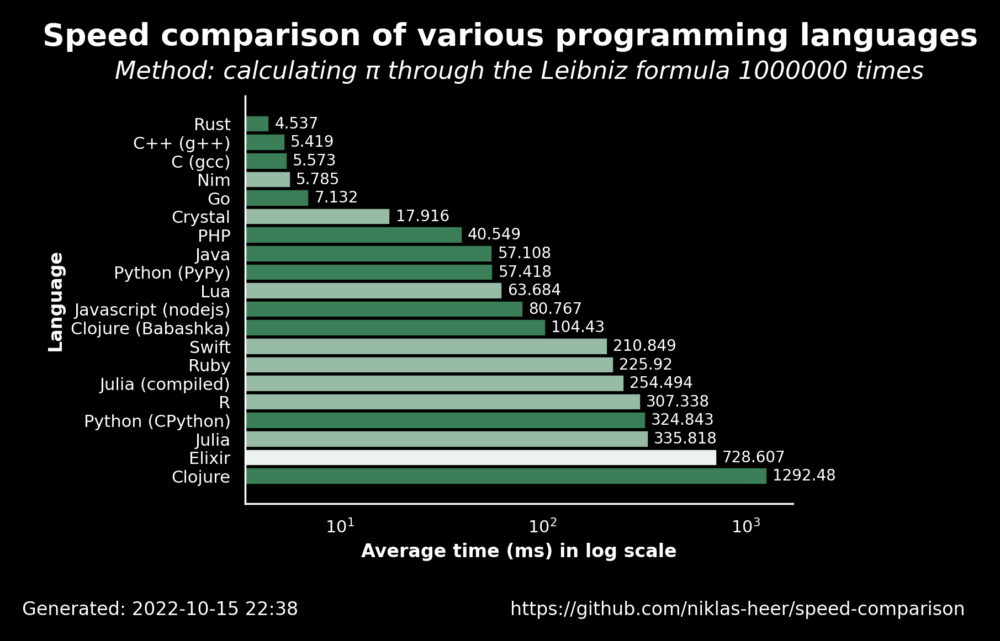

# 2022-10-15 22:39:09

## Speed comparison results

These are the latest speed comparison results of various programming languages.

### Raw results

| name                | version     | average            | accuracy           |
| ------------------- | ----------- | ------------------ | ------------------ |
| Rust                | 1.60.0      | 4.537              | 0.7222222222222222 |
| C++ (g++)           | 11.2.1      | 5.4190000000000005 | 0.7222222222222222 |
| C (gcc)             | 11.2.1      | 5.5729999999999995 | 0.7222222222222222 |
| Nim                 | 1.6.6       | 5.785              | 0.6666666666666666 |
| Go                  | 1.19.1      | 7.132000000000001  | 0.7222222222222222 |
| Crystal             | 1.4.1       | 17.916             | 0.6666666666666666 |
| PHP                 | 8.1.11      | 40.549             | 0.7222222222222222 |
| Java                | 19.36       | 57.108             | 0.7222222222222222 |
| Python (PyPy)       | 3.9.12      | 57.418             | 0.7222222222222222 |
| Lua                 | 5.4.4       | 63.684000000000005 | 0.6666666666666666 |
| Javascript (nodejs) | 18.9.1      | 80.76700000000001  | 0.7222222222222222 |
| Clojure (Babashka)  | 0.10.163    | 104.42999999999999 | 0.7222222222222222 |
| Swift               | 5.7         | 210.84900000000002 | 0.6666666666666666 |
| Ruby                | 3.1.2       | 225.92000000000002 | 0.6666666666666666 |
| Julia (compiled)    | 1.8.2       | 254.494            | 0.6666666666666666 |
| R                   | 4.2.0       | 307.338            | 0.6666666666666666 |
| Python (CPython)    | 3.10.5      | 324.843            | 0.7222222222222222 |
| Julia               | 1.8.2       | 335.818            | 0.6666666666666666 |
| Elixir              | 1.13.4      | 728.607            | 0.6111111111111112 |
| Clojure             | 1.11.1.1165 | 1292.4820000000002 | 0.7222222222222222 |
