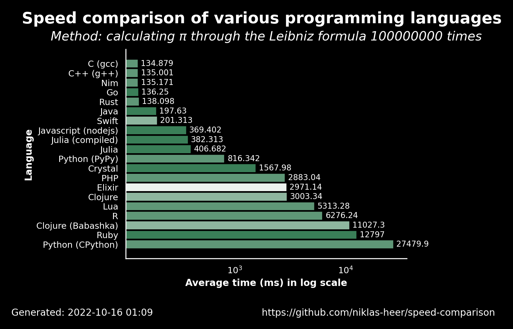

# 2022-10-16 01:09:41

## Speed comparison results

These are the latest speed comparison results of various programming languages.

### Raw results

| name                | version     | average            | accuracy           |
| ------------------- | ----------- | ------------------ | ------------------ |
| C (gcc)             | 11.2.1      | 134.879            | 0.7222222222222222 |
| C++ (g++)           | 11.2.1      | 135.001            | 0.7222222222222222 |
| Nim                 | 1.6.6       | 135.17100000000002 | 0.7222222222222222 |
| Go                  | 1.19.1      | 136.25             | 0.7647058823529411 |
| Rust                | 1.60.0      | 138.09799999999998 | 0.7222222222222222 |
| Java                | 19.36       | 197.63             | 0.7647058823529411 |
| Swift               | 5.7         | 201.313            | 0.6666666666666666 |
| Javascript (nodejs) | 18.9.1      | 369.402            | 0.7647058823529411 |
| Julia (compiled)    | 1.8.2       | 382.313            | 0.7647058823529411 |
| Julia               | 1.8.2       | 406.682            | 0.7647058823529411 |
| Python (PyPy)       | 3.9.12      | 816.342            | 0.7222222222222222 |
| Crystal             | 1.4.1       | 1567.985           | 0.7647058823529411 |
| PHP                 | 8.1.11      | 2883.0429999999997 | 0.7222222222222222 |
| Elixir              | 1.13.4      | 2971.1400000000003 | 0.5555555555555556 |
| Clojure             | 1.11.1.1165 | 3003.3379999999997 | 0.6666666666666666 |
| Lua                 | 5.4.4       | 5313.277           | 0.7222222222222222 |
| R                   | 4.2.0       | 6276.241           | 0.7222222222222222 |
| Clojure (Babashka)  | 0.10.163    | 11027.339          | 0.6666666666666666 |
| Ruby                | 3.1.2       | 12796.954          | 0.7647058823529411 |
| Python (CPython)    | 3.10.5      | 27479.858          | 0.7222222222222222 |
