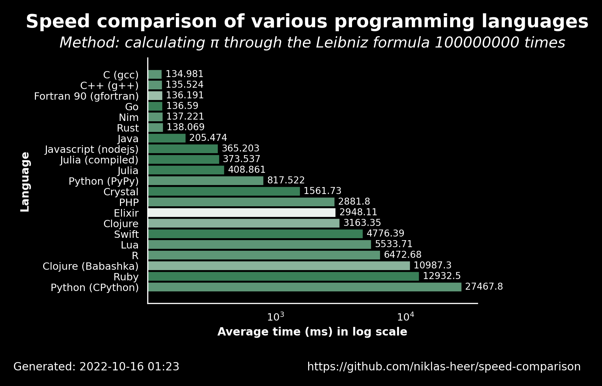

# 2022-10-16 01:24:05

## Speed comparison results

These are the latest speed comparison results of various programming languages.

### Raw results

| name                  | version     | average            | accuracy           |
| --------------------- | ----------- | ------------------ | ------------------ |
| C (gcc)               | 11.2.1      | 134.981            | 0.7222222222222222 |
| C++ (g++)             | 11.2.1      | 135.524            | 0.7222222222222222 |
| Fortran 90 (gfortran) | 11.2.1      | 136.191            | 0.65               |
| Go                    | 1.19.1      | 136.58999999999997 | 0.7647058823529411 |
| Nim                   | 1.6.6       | 137.221            | 0.7222222222222222 |
| Rust                  | 1.60.0      | 138.069            | 0.7222222222222222 |
| Java                  | 19.36       | 205.474            | 0.7647058823529411 |
| Javascript (nodejs)   | 18.9.1      | 365.203            | 0.7647058823529411 |
| Julia (compiled)      | 1.8.2       | 373.53700000000003 | 0.7647058823529411 |
| Julia                 | 1.8.2       | 408.861            | 0.7647058823529411 |
| Python (PyPy)         | 3.9.12      | 817.5219999999999  | 0.7222222222222222 |
| Crystal               | 1.4.1       | 1561.7250000000001 | 0.7647058823529411 |
| PHP                   | 8.1.11      | 2881.797           | 0.7222222222222222 |
| Elixir                | 1.13.4      | 2948.112           | 0.5555555555555556 |
| Clojure               | 1.11.1.1165 | 3163.351           | 0.6666666666666666 |
| Swift                 | 5.7         | 4776.394           | 0.7647058823529411 |
| Lua                   | 5.4.4       | 5533.713           | 0.7222222222222222 |
| R                     | 4.2.0       | 6472.675           | 0.7222222222222222 |
| Clojure (Babashka)    | 0.10.163    | 10987.257          | 0.6666666666666666 |
| Ruby                  | 3.1.2       | 12932.518999999998 | 0.7647058823529411 |
| Python (CPython)      | 3.10.5      | 27467.81           | 0.7222222222222222 |
