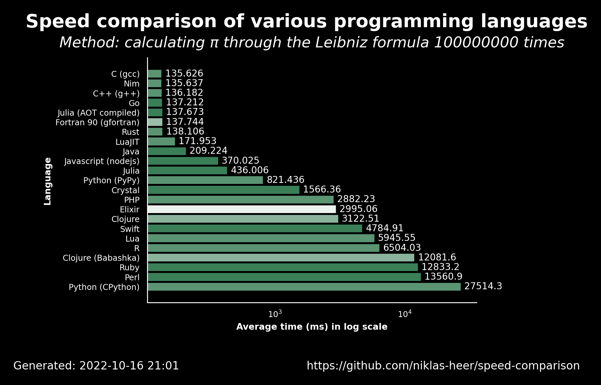

# 2022-10-16 21:01:49

## Speed comparison results

These are the latest speed comparison results of various programming languages.

### Raw results

| name                  | version     | average            | accuracy           |
| --------------------- | ----------- | ------------------ | ------------------ |
| C (gcc)               | 11.2.1      | 135.626            | 0.7222222222222222 |
| Nim                   | 1.6.6       | 135.637            | 0.7222222222222222 |
| C++ (g++)             | 11.2.1      | 136.182            | 0.7222222222222222 |
| Go                    | 1.19.1      | 137.212            | 0.7647058823529411 |
| Julia (AOT compiled)  | 1.8.2       | 137.673            | 0.7647058823529411 |
| Fortran 90 (gfortran) | 11.2.1      | 137.744            | 0.65               |
| Rust                  | 1.60.0      | 138.106            | 0.7222222222222222 |
| LuaJIT                | 2.1.0       | 171.953            | 0.7222222222222222 |
| Java                  | 19.36       | 209.224            | 0.7647058823529411 |
| Javascript (nodejs)   | 18.9.1      | 370.025            | 0.7647058823529411 |
| Julia                 | 1.8.2       | 436.00600000000003 | 0.7647058823529411 |
| Python (PyPy)         | 3.9.12      | 821.436            | 0.7222222222222222 |
| Crystal               | 1.4.1       | 1566.36            | 0.7647058823529411 |
| PHP                   | 8.1.11      | 2882.2290000000003 | 0.7222222222222222 |
| Elixir                | 1.13.4      | 2995.063           | 0.5555555555555556 |
| Clojure               | 1.11.1.1165 | 3122.513           | 0.6666666666666666 |
| Swift                 | 5.7         | 4784.915           | 0.7647058823529411 |
| Lua                   | 5.4.4       | 5945.551           | 0.7222222222222222 |
| R                     | 4.2.0       | 6504.028           | 0.7222222222222222 |
| Clojure (Babashka)    | 0.10.163    | 12081.562          | 0.6666666666666666 |
| Ruby                  | 3.1.2       | 12833.218          | 0.7647058823529411 |
| Perl                  | 5.34.1      | 13560.912          | 0.7647058823529411 |
| Python (CPython)      | 3.10.5      | 27514.323          | 0.7222222222222222 |
