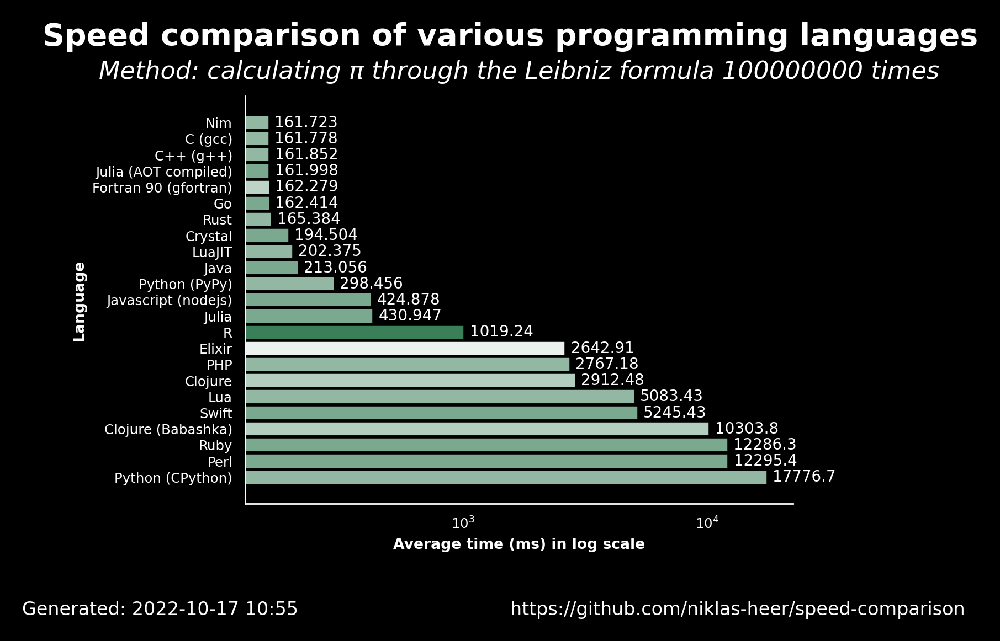

# 2022-10-17 10:56:11

## Speed comparison results

These are the latest speed comparison results of various programming languages.

### Raw results

| name                  | version     | average            | accuracy           |
| --------------------- | ----------- | ------------------ | ------------------ |
| Nim                   | 1.6.6       | 161.723            | 0.7222222222222222 |
| C (gcc)               | 11.2.1      | 161.778            | 0.7222222222222222 |
| C++ (g++)             | 11.2.1      | 161.852            | 0.7222222222222222 |
| Julia (AOT compiled)  | 1.8.2       | 161.998            | 0.7647058823529411 |
| Fortran 90 (gfortran) | 11.2.1      | 162.279            | 0.65               |
| Go                    | 1.19.1      | 162.41400000000002 | 0.7647058823529411 |
| Rust                  | 1.60.0      | 165.38400000000001 | 0.7222222222222222 |
| Crystal               | 1.4.1       | 194.50400000000002 | 0.7647058823529411 |
| LuaJIT                | 2.1.0       | 202.375            | 0.7222222222222222 |
| Java                  | 19.36       | 213.05599999999998 | 0.7647058823529411 |
| Python (PyPy)         | 3.9.12      | 298.456            | 0.7222222222222222 |
| Javascript (nodejs)   | 18.9.1      | 424.878            | 0.7647058823529411 |
| Julia                 | 1.8.2       | 430.947            | 0.7647058823529411 |
| R                     | 4.2.0       | 1019.2429999999999 | 0.8888888888888888 |
| Elixir                | 1.13.4      | 2642.913           | 0.5555555555555556 |
| PHP                   | 8.1.11      | 2767.183           | 0.7222222222222222 |
| Clojure               | 1.11.1.1165 | 2912.481           | 0.6666666666666666 |
| Lua                   | 5.4.4       | 5083.426           | 0.7222222222222222 |
| Swift                 | 5.7         | 5245.429999999999  | 0.7647058823529411 |
| Clojure (Babashka)    | 0.10.163    | 10303.784          | 0.6666666666666666 |
| Ruby                  | 3.1.2       | 12286.317000000001 | 0.7647058823529411 |
| Perl                  | 5.34.1      | 12295.441          | 0.7647058823529411 |
| Python (CPython)      | 3.10.5      | 17776.741          | 0.7222222222222222 |
