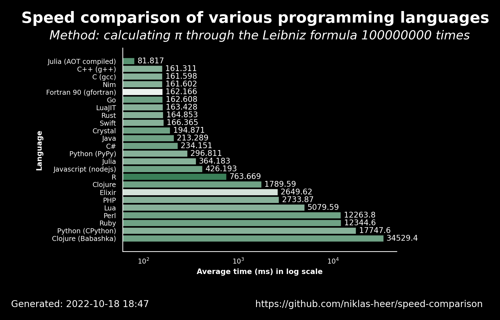

# 2022-10-18 18:48:06

## Speed comparison results

These are the latest speed comparison results of various programming languages.

### Raw results

| name                  | version     | average            | accuracy           |
| --------------------- | ----------- | ------------------ | ------------------ |
| Julia (AOT compiled)  | 1.8.2       | 81.81700000000001  | 0.8235294117647058 |
| C++ (g++)             | 11.2.1      | 161.311            | 0.7222222222222222 |
| C (gcc)               | 11.2.1      | 161.59799999999998 | 0.7222222222222222 |
| Nim                   | 1.6.6       | 161.602            | 0.7222222222222222 |
| Fortran 90 (gfortran) | 11.2.1      | 162.166            | 0.5                |
| Go                    | 1.19.1      | 162.608            | 0.7647058823529411 |
| LuaJIT                | 2.1.0       | 163.428            | 0.7222222222222222 |
| Rust                  | 1.60.0      | 164.853            | 0.7222222222222222 |
| Swift                 | 5.7         | 166.365            | 0.7222222222222222 |
| Crystal               | 1.4.1       | 194.87099999999998 | 0.7647058823529411 |
| Java                  | 19.36       | 213.28900000000002 | 0.7647058823529411 |
| C#                    | 7.0.100     | 234.151            | 0.7647058823529411 |
| Python (PyPy)         | 3.9.12      | 296.811            | 0.7222222222222222 |
| Julia                 | 1.8.2       | 364.183            | 0.7222222222222222 |
| Javascript (nodejs)   | 18.9.1      | 426.193            | 0.7647058823529411 |
| R                     | 4.2.0       | 763.6690000000001  | 0.8888888888888888 |
| Clojure               | 1.11.1.1165 | 1789.589           | 0.7647058823529411 |
| Elixir                | 1.13.4      | 2649.622           | 0.5555555555555556 |
| PHP                   | 8.1.11      | 2733.872           | 0.7222222222222222 |
| Lua                   | 5.4.4       | 5079.589           | 0.7222222222222222 |
| Perl                  | 5.34.1      | 12263.825          | 0.7647058823529411 |
| Ruby                  | 3.1.2       | 12344.641          | 0.7647058823529411 |
| Python (CPython)      | 3.10.5      | 17747.598          | 0.7222222222222222 |
| Clojure (Babashka)    | 1.0.164     | 34529.367999999995 | 0.7647058823529411 |
