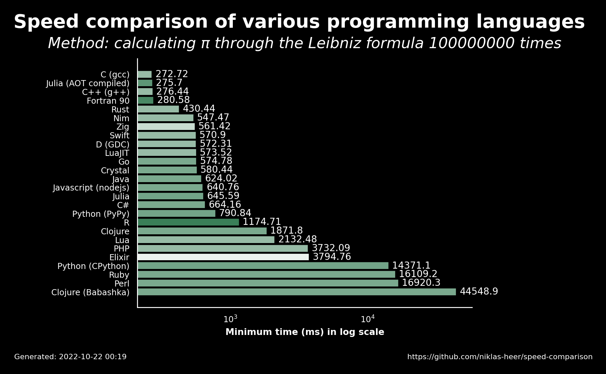

# 2022-10-22 00:19:50

## Speed comparison results

These are the latest speed comparison results of various programming languages.

### Raw results

| name                 | version     | median   | min      | max      | accuracy |
| -------------------- | ----------- | -------- | -------- | -------- | -------- |
| C (gcc)              | 11.2.1      | 280.43   | 272.72   | 283.39   | 0.7222   |
| Julia (AOT compiled) | 1.8.2       | 276.84   | 275.7    | 279.85   | 0.8235   |
| C++ (g++)            | 11.2.1      | 285.59   | 276.44   | 306.51   | 0.7222   |
| Fortran 90           | 12.1.0      | 283.32   | 280.58   | 292.24   | 0.8571   |
| Rust                 | 1.60.0      | 434.33   | 430.44   | 438.27   | 0.7222   |
| Nim                  | 1.6.6       | 565.49   | 547.47   | 579.09   | 0.7222   |
| Zig                  | 0.9.1       | 563.56   | 561.42   | 565.32   | 0.619    |
| Swift                | 5.7         | 581.12   | 570.9    | 595.51   | 0.7222   |
| D (GDC)              | 11.2.1      | 578.29   | 572.31   | 590.41   | 0.7222   |
| LuaJIT               | 2.1.0       | 579.52   | 573.52   | 594.28   | 0.7222   |
| Go                   | 1.19.1      | 593.91   | 574.78   | 610.51   | 0.7647   |
| Crystal              | 1.6.1       | 581.41   | 580.44   | 584.58   | 0.7647   |
| Java                 | 19.36       | 628.11   | 624.02   | 660.34   | 0.7647   |
| Javascript (nodejs)  | 18.9.1      | 642.88   | 640.76   | 648.15   | 0.7647   |
| Julia                | 1.8.2       | 652.57   | 645.59   | 653.31   | 0.7778   |
| C#                   | 7.0.100     | 702.73   | 664.16   | 718.94   | 0.7647   |
| Python (PyPy)        | 3.9.12      | 802.23   | 790.84   | 813.99   | 0.7778   |
| R                    | 4.2.0       | 1205.99  | 1174.71  | 1214.01  | 0.8889   |
| Clojure              | 1.11.1.1165 | 2282.09  | 1871.8   | 2770.49  | 0.7647   |
| Lua                  | 5.4.4       | 2159.6   | 2132.48  | 2167.09  | 0.7222   |
| PHP                  | 8.1.11      | 3742.29  | 3732.09  | 3753.07  | 0.7222   |
| Elixir               | 1.13.4      | 3803.57  | 3794.76  | 3812.69  | 0.5556   |
| Python (CPython)     | 3.10.5      | 14522.58 | 14371.1  | 14545.44 | 0.7778   |
| Ruby                 | 3.1.2       | 16213.46 | 16109.17 | 16694.84 | 0.7647   |
| Perl                 | 5.34.1      | 16973.99 | 16920.33 | 17647.23 | 0.7647   |
| Clojure (Babashka)   | 1.0.164     | 44762.16 | 44548.92 | 45743.96 | 0.7647   |
