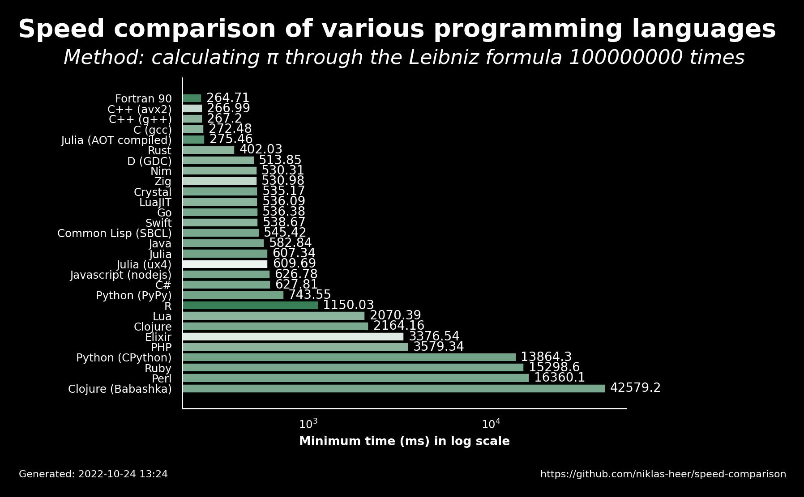

# 2022-10-24 13:24:44

## Speed comparison results

These are the latest speed comparison results of various programming languages.

### Raw results

| name                 | version     | median   | min      | max      | accuracy |
| -------------------- | ----------- | -------- | -------- | -------- | -------- |
| Fortran 90           | 12.1.0      | 272.34   | 264.71   | 277.0    | 0.8571   |
| C++ (avx2)           | 11.2.1      | 269.29   | 266.99   | 270.64   | 0.6111   |
| C++ (g++)            | 11.2.1      | 268.38   | 267.2    | 269.25   | 0.7222   |
| C (gcc)              | 11.2.1      | 272.87   | 272.48   | 273.78   | 0.7222   |
| Julia (AOT compiled) | 1.8.2       | 277.39   | 275.46   | 281.53   | 0.8235   |
| Rust                 | 1.60.0      | 410.0    | 402.03   | 415.0    | 0.7222   |
| D (GDC)              | 11.2.1      | 522.92   | 513.85   | 545.71   | 0.7222   |
| Nim                  | 1.6.6       | 533.6    | 530.31   | 541.61   | 0.7222   |
| Zig                  | 0.9.1       | 534.05   | 530.98   | 541.59   | 0.619    |
| Crystal              | 1.6.1       | 536.83   | 535.17   | 541.24   | 0.7647   |
| LuaJIT               | 2.1.0       | 536.7    | 536.09   | 559.48   | 0.7222   |
| Go                   | 1.19.1      | 540.74   | 536.38   | 541.87   | 0.7647   |
| Swift                | 5.7         | 540.26   | 538.67   | 546.98   | 0.7222   |
| Common Lisp (SBCL)   | 2.2.5       | 559.56   | 545.42   | 567.73   | 0.7647   |
| Java                 | 19.36       | 592.56   | 582.84   | 595.11   | 0.7647   |
| Julia                | 1.8.2       | 617.18   | 607.34   | 646.7    | 0.7778   |
| Julia (ux4)          | 1.8.2       | 624.49   | 609.69   | 635.99   | 0.5294   |
| Javascript (nodejs)  | 18.9.1      | 639.0    | 626.78   | 642.8    | 0.7647   |
| C#                   | 7.0.100     | 635.31   | 627.81   | 635.63   | 0.7647   |
| Python (PyPy)        | 3.9.12      | 770.1    | 743.55   | 771.87   | 0.7778   |
| R                    | 4.2.0       | 1155.18  | 1150.03  | 1176.05  | 0.8889   |
| Lua                  | 5.4.4       | 2070.58  | 2070.39  | 2086.1   | 0.7222   |
| Clojure              | 1.11.1.1165 | 2294.85  | 2164.16  | 2627.45  | 0.7647   |
| Elixir               | 1.13.4      | 3422.85  | 3376.54  | 3493.03  | 0.5556   |
| PHP                  | 8.1.11      | 3602.1   | 3579.34  | 3609.62  | 0.7222   |
| Python (CPython)     | 3.10.5      | 13886.55 | 13864.26 | 13957.38 | 0.7778   |
| Ruby                 | 3.1.2       | 15456.42 | 15298.56 | 15572.77 | 0.7647   |
| Perl                 | 5.34.1      | 16407.94 | 16360.07 | 16416.01 | 0.7647   |
| Clojure (Babashka)   | 1.0.164     | 43166.75 | 42579.25 | 44478.49 | 0.7647   |
