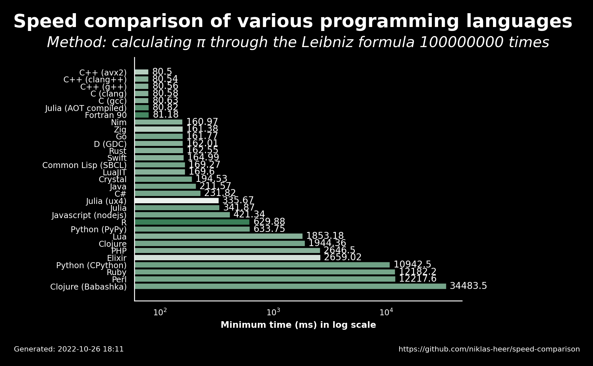

# 2022-10-26 18:11:26

## Speed comparison results

These are the latest speed comparison results of various programming languages.

### Raw results

| name                 | version     | median   | min      | max      | accuracy |
| -------------------- | ----------- | -------- | -------- | -------- | -------- |
| C++ (avx2)           | 11.2.1      | 80.58    | 80.5     | 80.74    | 0.6111   |
| C++ (clang++)        | 13.0.1      | 80.55    | 80.54    | 81.11    | 0.7222   |
| C++ (g++)            | 11.2.1      | 80.59    | 80.56    | 80.84    | 0.7222   |
| C (clang)            | 13.0.1      | 80.6     | 80.58    | 80.68    | 0.7222   |
| C (gcc)              | 11.2.1      | 80.78    | 80.63    | 81.07    | 0.7222   |
| Julia (AOT compiled) | 1.8.2       | 80.83    | 80.82    | 80.85    | 0.8235   |
| Fortran 90           | 12.1.0      | 81.2     | 81.18    | 81.48    | 0.8571   |
| Nim                  | 1.6.6       | 160.99   | 160.97   | 161.39   | 0.7222   |
| Zig                  | 0.9.1       | 161.43   | 161.38   | 163.14   | 0.619    |
| Go                   | 1.19.1      | 162.43   | 161.77   | 162.81   | 0.7647   |
| D (GDC)              | 11.2.1      | 162.57   | 162.01   | 162.59   | 0.7222   |
| Rust                 | 1.60.0      | 163.16   | 162.55   | 163.4    | 0.7222   |
| Swift                | 5.7         | 165.51   | 164.99   | 165.73   | 0.7222   |
| Common Lisp (SBCL)   | 2.2.5       | 169.82   | 169.27   | 170.13   | 0.7647   |
| LuaJIT               | 2.1.0       | 169.72   | 169.6    | 169.74   | 0.7222   |
| Crystal              | 1.6.1       | 194.54   | 194.53   | 195.01   | 0.7647   |
| Java                 | 19.36       | 212.05   | 211.57   | 214.47   | 0.7647   |
| C#                   | 7.0.100     | 232.49   | 231.82   | 234.77   | 0.7647   |
| Julia (ux4)          | 1.8.2       | 347.36   | 335.67   | 349.6    | 0.5      |
| Julia                | 1.8.2       | 345.99   | 341.87   | 353.3    | 0.7778   |
| Javascript (nodejs)  | 18.9.1      | 421.71   | 421.34   | 422.6    | 0.7647   |
| R                    | 4.2.0       | 637.76   | 629.88   | 670.97   | 0.8889   |
| Python (PyPy)        | 3.9.12      | 634.97   | 633.75   | 636.67   | 0.7778   |
| Lua                  | 5.4.4       | 1854.47  | 1853.18  | 1855.89  | 0.7222   |
| Clojure              | 1.11.1.1165 | 1975.58  | 1944.36  | 2002.97  | 0.7647   |
| PHP                  | 8.1.12      | 2649.41  | 2646.5   | 2659.16  | 0.7222   |
| Elixir               | 1.13.4      | 2682.94  | 2659.02  | 2683.07  | 0.5556   |
| Python (CPython)     | 3.10.5      | 10952.63 | 10942.47 | 10963.49 | 0.7778   |
| Ruby                 | 3.1.2       | 12281.64 | 12182.24 | 12420.25 | 0.7647   |
| Perl                 | 5.34.1      | 12245.83 | 12217.56 | 12247.69 | 0.7647   |
| Clojure (Babashka)   | 1.0.164     | 34700.28 | 34483.48 | 34707.12 | 0.7647   |
