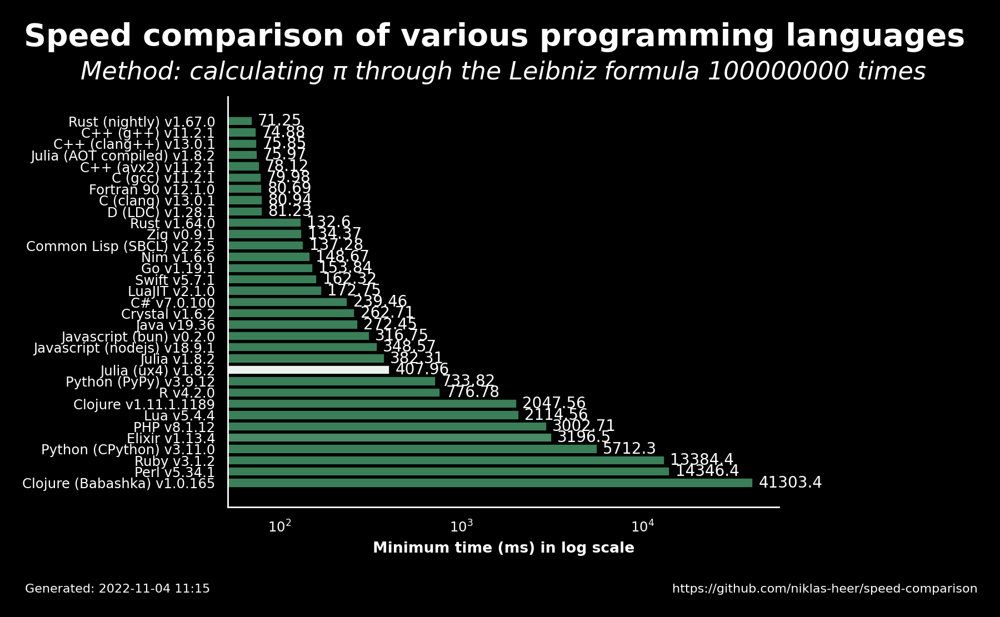

# 2022-11-04 11:15:33

## Speed comparison results

These are the latest speed comparison results of various programming languages.

### Raw results

| name                 | version     | median   | min      | max      | accuracy |
| -------------------- | ----------- | -------- | -------- | -------- | -------- |
| Rust (nightly)       | 1.67.0      | 71.68    | 71.25    | 72.34    | 8.497    |
| C++ (g++)            | 11.2.1      | 77.19    | 74.88    | 83.14    | 8.4968   |
| C++ (clang++)        | 13.0.1      | 78.67    | 75.85    | 83.32    | 8.4972   |
| Julia (AOT compiled) | 1.8.2       | 76.29    | 75.97    | 80.75    | 8.4971   |
| C++ (avx2)           | 11.2.1      | 79.41    | 78.12    | 80.14    | 8.4969   |
| C (gcc)              | 11.2.1      | 81.13    | 79.98    | 90.05    | 8.4968   |
| Fortran 90           | 12.1.0      | 80.99    | 80.69    | 81.79    | 8.4972   |
| C (clang)            | 13.0.1      | 81.62    | 80.94    | 86.4     | 8.4972   |
| D (LDC)              | 1.28.1      | 81.51    | 81.23    | 83.07    | 8.4972   |
| Rust                 | 1.64.0      | 140.3    | 132.6    | 145.27   | 8.4972   |
| Zig                  | 0.9.1       | 136.26   | 134.37   | 139.58   | 8.4972   |
| Common Lisp (SBCL)   | 2.2.5       | 143.87   | 137.28   | 145.12   | 8.4972   |
| Nim                  | 1.6.6       | 151.05   | 148.67   | 151.56   | 8.4971   |
| Go                   | 1.19.1      | 153.97   | 153.84   | 154.12   | 8.4972   |
| Swift                | 5.7.1       | 164.72   | 162.32   | 166.18   | 8.4971   |
| LuaJIT               | 2.1.0       | 173.36   | 172.75   | 177.25   | 8.4971   |
| C#                   | 7.0.100     | 242.75   | 239.46   | 248.25   | 8.4972   |
| Crystal              | 1.6.2       | 266.08   | 262.71   | 269.32   | 8.4971   |
| Java                 | 19.36       | 272.64   | 272.45   | 274.38   | 8.4972   |
| Javascript (bun)     | 0.2.0       | 325.41   | 316.75   | 328.44   | 8.4972   |
| Javascript (nodejs)  | 18.9.1      | 348.7    | 348.57   | 363.26   | 8.4972   |
| Julia                | 1.8.2       | 383.88   | 382.31   | 390.31   | 8.4971   |
| Julia (ux4)          | 1.8.2       | 410.79   | 407.96   | 414.04   | 7.7981   |
| Python (PyPy)        | 3.9.12      | 746.46   | 733.82   | 762.73   | 8.4972   |
| R                    | 4.2.0       | 780.99   | 776.78   | 787.48   | 8.4971   |
| Clojure              | 1.11.1.1189 | 2143.41  | 2047.56  | 2160.62  | 8.4972   |
| Lua                  | 5.4.4       | 2122.53  | 2114.56  | 2141.71  | 8.4971   |
| PHP                  | 8.1.12      | 3031.97  | 3002.71  | 3039.99  | 8.4972   |
| Elixir               | 1.13.4      | 3327.49  | 3196.5   | 3483.97  | 8.4326   |
| Python (CPython)     | 3.11.0      | 5972.53  | 5712.3   | 6366.87  | 8.4972   |
| Ruby                 | 3.1.2       | 13401.69 | 13384.37 | 13619.6  | 8.4971   |
| Perl                 | 5.34.1      | 14412.98 | 14346.36 | 14738.61 | 8.4971   |
| Clojure (Babashka)   | 1.0.165     | 41737.36 | 41303.44 | 41957.91 | 8.4972   |
