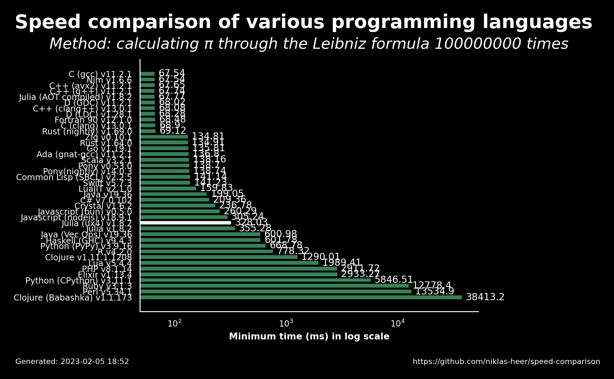

# 2023-02-05 18:52:35

## Speed comparison results

These are the latest speed comparison results of various programming languages.

### Raw results

| name                 | version     | median   | min      | max      | accuracy |
| -------------------- | ----------- | -------- | -------- | -------- | -------- |
| C (gcc)              | 11.2.1      | 67.81    | 67.54    | 68.31    | 8.4968   |
| Nim                  | 1.6.6       | 68.32    | 67.54    | 69.06    | 8.4975   |
| C++ (avx2)           | 11.2.1      | 67.89    | 67.65    | 68.82    | 8.4969   |
| C++ (g++)            | 11.2.1      | 68.41    | 67.74    | 68.87    | 8.4968   |
| Julia (AOT compiled) | 1.8.2       | 67.8     | 67.77    | 68.12    | 8.4971   |
| D (GDC)              | 11.2.1      | 68.99    | 68.02    | 69.27    | 8.4968   |
| C++ (clang++)        | 13.0.1      | 68.28    | 68.08    | 68.47    | 8.4972   |
| D (LDC)              | 1.28.1      | 68.55    | 68.28    | 69.39    | 8.4972   |
| Fortran 90           | 12.1.0      | 68.49    | 68.48    | 68.53    | 8.4972   |
| C (clang)            | 13.0.1      | 69.01    | 68.9     | 69.29    | 8.4972   |
| Rust (nightly)       | 1.69.0      | 69.31    | 69.12    | 69.69    | 8.497    |
| Zig                  | 0.10.1      | 135.19   | 134.81   | 135.77   | 8.4972   |
| Rust                 | 1.64.0      | 135.35   | 134.91   | 135.98   | 8.4972   |
| Go                   | 1.19.1      | 136.06   | 135.81   | 136.45   | 8.4972   |
| Ada (gnat-gcc)       | 11.2.1      | 138.0    | 136.8    | 142.38   | 8.4971   |
| Scala                | 3.2.1       | 138.46   | 138.16   | 138.58   | 8.4972   |
| Pony                 | 0.53.0      | 138.7    | 138.7    | 139.36   | 8.4972   |
| Pony(nightly)        | 14.0.3      | 139.08   | 138.74   | 139.17   | 8.4972   |
| Common Lisp (SBCL)   | 2.2.5       | 142.34   | 141.14   | 142.45   | 8.4972   |
| Swift                | 5.7.3       | 141.49   | 141.23   | 141.58   | 8.4971   |
| LuaJIT               | 2.1.0       | 160.48   | 159.83   | 161.13   | 8.4971   |
| Java                 | 19.36       | 199.95   | 199.05   | 201.69   | 8.4972   |
| C#                   | 7.0.102     | 211.89   | 209.36   | 212.02   | 8.4972   |
| Crystal              | 1.6.2       | 237.19   | 236.78   | 237.86   | 8.4971   |
| Javascript (bun)     | 0.5.0       | 260.57   | 260.29   | 291.51   | 8.4972   |
| Javascript (nodejs)  | 18.9.1      | 305.51   | 305.24   | 306.15   | 8.4972   |
| Julia (ux4)          | 1.8.2       | 328.47   | 328.03   | 339.95   | 5.534    |
| Julia                | 1.8.2       | 363.49   | 355.28   | 391.66   | 8.4971   |
| Java (Vec Ops)       | 19.36       | 603.78   | 600.98   | 609.08   | 8.4972   |
| Haskell (GHC)        | 9.4.3       | 601.84   | 601.78   | 601.88   | 8.4972   |
| Python (PyPy)        | 3.9.16      | 679.79   | 668.78   | 686.2    | 8.4972   |
| R                    | 4.2.0       | 782.5    | 778.32   | 790.7    | 8.4971   |
| Clojure              | 1.11.1.1208 | 1323.37  | 1290.01  | 1342.18  | 8.4972   |
| Lua                  | 5.4.4       | 1991.52  | 1989.41  | 1993.53  | 8.4971   |
| PHP                  | 8.1.14      | 2911.8   | 2911.72  | 2911.92  | 8.4972   |
| Elixir               | 1.13.4      | 2954.23  | 2933.27  | 3106.27  | 8.4326   |
| Python (CPython)     | 3.11.1      | 5851.53  | 5846.51  | 5940.52  | 8.4972   |
| Ruby                 | 3.1.3       | 12782.24 | 12778.38 | 12958.93 | 8.4971   |
| Perl                 | 5.34.1      | 13576.94 | 13534.89 | 13594.96 | 8.4971   |
| Clojure (Babashka)   | 1.1.173     | 38624.07 | 38413.17 | 39045.74 | 8.4972   |
